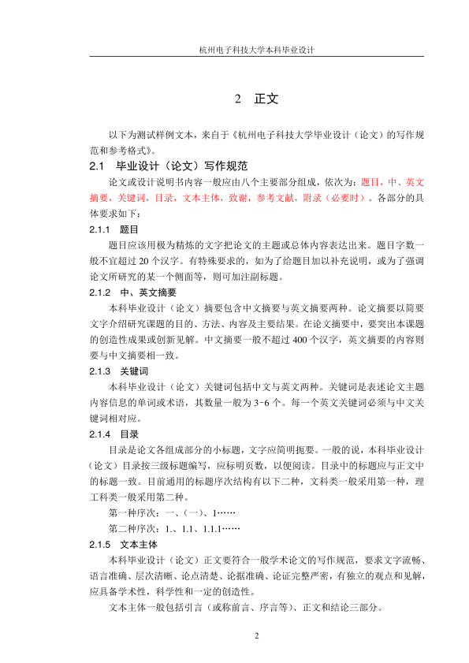

# LaTeX-HDU-Bachelor-Thesis

LaTeX template for bachelor thesis of Hangzhou Dianzi University

杭州电子科技大学本科毕业设计的 LaTeX 模板

---

这是一个适用于杭州电子科技大学本科毕业设计的 LaTeX 模版。

这个模板目前只支持 XeLaTeX 引擎，不支持 pdfLaTeX 和 LuaLaTeX 引擎。

示例文章：[example.pdf](example.pdf)

示例源码：[example.tex](example.pdf)

这个模板包含一个内建的封面，可以使用
```tex
\maketitle
```
命令来调用内建的封面。但不同学院的封面版式可能有细微差别。这种情况下，可以使用 Microsoft Word 制作封面，导出 PDF 后使用
```tex
\includepdf[pages={-}]{封面.pdf}
```
命令来插入封面。

欲使用这个模板，请将 [HDU-Bachelor-Thesis.cls](HDU-Bachelor-Thesis.cls) 复制到你的工程目录下，并指定
```tex
\documentclass{HDU-Bachelor-Thesis}
```
为文档模板。

如果需要输出 Microsoft Word 格式以进行论文查重，可以尝试 [Foxit PDF 转 Word](http://pdf2word.pdf365.cn/)（付费软件）。本模板的排版效果可被其识别。

## 预览





